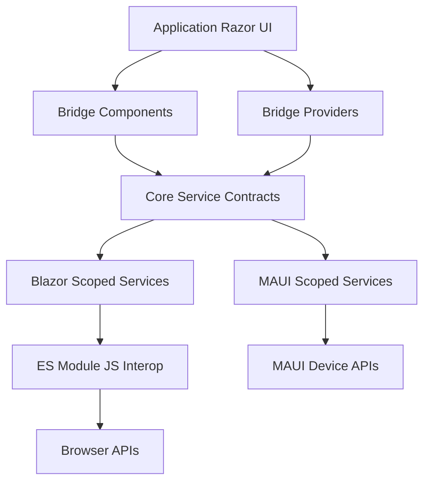

# Bridge Architecture

This document describes how Circuids Bridge is structured internally, how the runtime services cooperate, and where host-specific behavior belongs. It is intended for contributors and maintainers who need to change Bridge itself, add host behavior, or reason about lifecycle and initialization.

For test strategy, see [testing-architecture.md](testing-architecture.md).

---

## Design Goals

Bridge exists to let shared Razor UI adapt to the current host without putting platform branches throughout application components.

The architecture is built around these goals:

- Keep shared UI host-agnostic.
- Keep all public contracts in the core package.
- Put platform-specific runtime detection behind DI services.
- Register the same five services for every supported host.
- Initialize services from a provider in the render tree, not from constructors.
- Keep Blazor-specific browser work in JavaScript modules.
- Keep MAUI-specific work in the MAUI integration project.
- Use `BridgeException` for Bridge-layer failures.

---

## Project Boundaries

| Area | Path | Responsibility |
|------|------|----------------|
| Core package | `src/Core/Circuids.Bridge` | Public interfaces, enums, value objects, Razor components, providers, handlers, and exceptions. |
| Blazor integration | `src/Integrations/Circuids.Bridge.Blazor` | Blazor WebAssembly and Blazor Server implementations backed by JS interop modules. |
| MAUI integration | `src/Integrations/Circuids.Bridge.Maui` | MAUI Blazor Hybrid implementations backed by MAUI APIs. |
| Samples | `sample/` | Shared sample catalog plus thin host shells. Samples demonstrate usage; they are not test runners. |
| Tests | `src/Tests` | Unit, component, adapter, and real-host conformance coverage. |
| Docs | `docs/` | Public usage docs and contributor-facing architecture docs. |

The core package should not contain platform-specific implementation code. The only platform conditionals belong in the MAUI integration project, where the target platform APIs are available.

---

## High-Level Runtime Model



Applications consume Bridge through Razor components or injected interfaces. The host project decides which implementation package is registered:

- Blazor hosts call `AddBridgeForBlazor()`.
- MAUI hosts call `AddBridgeForMaui()`.

Both extension methods register the same service contracts as scoped services.

---

## Public Service Contracts

All contracts live in the `Circuids.Bridge` namespace.

| Contract | Responsibility | Primary State | Change Event |
|----------|----------------|---------------|--------------|
| `IBridge` | Host and OS platform detection. | `Host`, `Platform`, `PlatformVersion`, `IsInitialized` | `PlatformChanged` |
| `IBridgeFormFactor` | Form factor and viewport/window size detection. | `FormFactorInfo` | `FormFactorChanged` |
| `IBridgeConnectivity` | Online/offline status. | `IsConnected` | `ConnectionChanged` |
| `IBridgeTheme` | Light/dark theme detection. | `Theme` | `ThemeChanged` |
| `IBridgeSafeArea` | Safe area insets for notches/cutouts. | `SafeAreaInsets` | `SafeAreaChanged` |

All implementations are expected to be idempotent: calling `InitializeAsync()` more than once should be safe and should not duplicate listeners or expensive setup.

---

## Dependency Injection Model

Bridge uses scoped services for every host integration:

```csharp
services.AddScoped<IBridge, BridgeBlazor>();
services.AddScoped<IBridgeFormFactor, BridgeFormFactorBlazor>();
services.AddScoped<IBridgeConnectivity, BridgeConnectivityBlazor>();
services.AddScoped<IBridgeTheme, BridgeThemeBlazor>();
services.AddScoped<IBridgeSafeArea, BridgeSafeAreaBlazor>();
```

The MAUI integration registers the same contracts with MAUI implementations.

Scoped lifetime is important because:

- Blazor Server circuits need per-circuit state.
- Blazor WebAssembly apps get app-scoped behavior from scoped services.
- MAUI Blazor Hybrid pages can resolve the same abstractions without introducing singleton state across app surfaces.
- Event subscriptions and JS/native listeners belong to a bounded service lifetime.

Do not register Bridge services as singleton or transient.

---

## Provider Lifecycle

`BridgeProvider` is the normal application-level entry point. It initializes all five services from `OnAfterRenderAsync(firstRender)` in this exact order:

1. `IBridge.InitializeAsync()`
2. `IBridgeFormFactor.InitializeAsync(FormFactorResizeMode)`
3. `IBridgeConnectivity.InitializeAsync(ConnectivityOptions)`
4. `IBridgeTheme.InitializeAsync()`
5. `IBridgeSafeArea.InitializeAsync()`

`BridgeProvider` does not render `ChildContent` until all five services complete initialization. This prevents most consumers from seeing partially initialized Bridge state inside a provider subtree.

Use the individual providers when an app wants only part of the system initialized in a specific layout region:

| Provider | Initializes |
|----------|-------------|
| `BridgeFormFactorProvider` | `IBridgeFormFactor` |
| `BridgeConnectivityProvider` | `IBridgeConnectivity` |
| `BridgeThemeProvider` | `IBridgeTheme` |
| `BridgeSafeAreaProvider` | `IBridgeSafeArea` |

Individual providers do not initialize `IBridge`. If host/platform state is needed, use `BridgeProvider` or initialize `IBridge` explicitly in custom composition code.

---

## Component Architecture

Bridge components live in the core package and depend only on the public service contracts.

| Component | Contract | Rendering Model |
|-----------|----------|-----------------|
| `BridgeHost` | `IBridge` | Selects `Maui`, `Blazor`, `Wpf`, `WinForms`, or `Default`. |
| `BridgePlatform` | `IBridge` | Selects `Android`, `IOS`, `Windows`, `Mac`, `Linux`, or `Default`. |
| `BridgeFormFactor` | `IBridgeFormFactor` | Selects form factor slots and supports two-way binding. |
| `BridgeConnectivity` | `IBridgeConnectivity` | Selects `Online` or `Offline`. |
| `BridgeTheme` | `IBridgeTheme` | Selects `Light`, `Dark`, or `Default`. |
| `BridgeSafeArea` | `IBridgeSafeArea` | Provides `SafeAreaInsets` to child content. |

Components subscribe to service events after the first render and use `InvokeAsync(StateHasChanged)` when handling events. This is required for Blazor Server safety because service callbacks may not arrive on the renderer thread.

`BridgeFormFactor` has the richest component behavior:

- `ChildContent` receives the current `FormFactorInfo` before slot selection.
- `ListenOnce="true"` avoids attaching a resize listener.
- The component creates a listener when it needs ongoing resize updates.
- Disposal releases the listener through `IBridgeFormFactor.DisposeListenerAsync()`.

Form factor slot fallback order is part of the public component contract:

| Active Form Factor | Slot Priority |
|--------------------|---------------|
| `Phone` | `Phone`, `TabletAndPhone`, `DesktopAndPhone`, `Default` |
| `Tablet` | `Tablet`, `TabletAndPhone`, `DesktopAndTablet`, `Default` |
| `Desktop` | `Desktop`, `DesktopAndTablet`, `DesktopAndPhone`, `Default` |
| `Unknown` | `Default` |

---

## Blazor Integration Architecture

The Blazor integration is implemented in `src/Integrations/Circuids.Bridge.Blazor`.

Public surface:

- `AddBridgeForBlazor()` in the `Circuids.Bridge.Blazor` namespace.

Internal implementation:

- `BridgeBlazor`
- `BridgeFormFactorBlazor`
- `BridgeConnectivityBlazor`
- `BridgeThemeBlazor`
- `BridgeSafeAreaBlazor`

JavaScript modules:

| Module | Used By | Browser Responsibility |
|--------|---------|------------------------|
| `Bridge.js` | `BridgeBlazor` | Host platform and version detection from browser/user agent data. |
| `BridgeFormFactor.js` | `BridgeFormFactorBlazor` | Viewport size, form factor classification, resize listener. |
| `BridgeConnectivity.js` | `BridgeConnectivityBlazor` | `navigator.onLine` plus optional HEAD polling. |
| `BridgeTheme.js` | `BridgeThemeBlazor` | `prefers-color-scheme` detection and listener. |
| `BridgeSafeArea.js` | `BridgeSafeAreaBlazor` | CSS safe-area environment variables and listener. |

Each Blazor adapter follows the same shape:

- Store the JS module import in `Lazy<Task<IJSObjectReference>>`.
- Import modules with `_content/Circuids.Bridge.Blazor/{Module}.js` paths.
- Keep adapter state in private set properties.
- Guard `InitializeAsync()` with an idempotency flag.
- Use `DotNetObjectReference<T>` when JavaScript calls back into .NET.
- Dispose JS listeners and modules from `DisposeAsync()`.
- Throw `BridgeException` for Bridge-layer initialization failures.

Blazor callbacks are used for ongoing state changes:

- Connectivity invokes `NotifyConnectivityStatusChanged`.
- Form factor invokes `NotifyFormFactorChanged`.
- Theme invokes `NotifyThemeChanged`.
- Safe area invokes `NotifySafeAreaChanged`.

The JS files use ES module named exports. They should not create global functions or default exports.

---

## MAUI Integration Architecture

The MAUI integration is implemented in `src/Integrations/Circuids.Bridge.Maui`.

Public surface:

- `AddBridgeForMaui()` in the `Circuids.Bridge.Maui` namespace.

Internal implementation:

- `BridgeMaui`
- `BridgeFormFactorMaui`
- `BridgeConnectivityMaui`
- `BridgeThemeMaui`
- `BridgeSafeAreaMaui`

MAUI adapters call MAUI APIs directly instead of wrapping them behind additional abstractions:

| Adapter | MAUI APIs |
|---------|-----------|
| `BridgeMaui` | `DeviceInfo.Platform`, `DeviceInfo.Version` |
| `BridgeConnectivityMaui` | `Connectivity.NetworkAccess`, `Connectivity.ConnectivityChanged` |
| `BridgeThemeMaui` | `Application.Current.RequestedTheme`, `RequestedThemeChanged` |
| `BridgeFormFactorMaui` | `Application.Current.Windows`, `MainThread` |
| `BridgeSafeAreaMaui` | Android window insets, iOS/Mac Catalyst `UIWindow.SafeAreaInsets` |

Platform-specific `#if` code is allowed only inside the MAUI integration project. The core package and Blazor integration remain free of platform conditionals.

MAUI form factor uses a reference-counted listener model like the Blazor adapter. It delays listener disposal briefly so rapid component mount/unmount cycles do not thrash resize subscriptions.

---

## Feature Data Flow

| Feature | Core Contract | Blazor Data Source | MAUI Data Source |
|---------|---------------|--------------------|------------------|
| Host | `IBridge.Host` | Constant `Host.Blazor` | Constant `Host.Maui` |
| Platform | `IBridge.Platform` | Browser detection through `Bridge.js` | `DeviceInfo.Platform` |
| Version | `IBridge.PlatformVersion` | Browser version detection through `Bridge.js` | `DeviceInfo.Version` |
| Form factor | `IBridgeFormFactor.FormFactor` | Viewport width and height | Current window width and height |
| Connectivity | `IBridgeConnectivity.IsConnected` | `navigator.onLine` plus optional HEAD polling | `Connectivity.NetworkAccess` |
| Theme | `IBridgeTheme.Theme` | `matchMedia('(prefers-color-scheme: dark)')` | `Application.Current.RequestedTheme` |
| Safe area | `IBridgeSafeArea.SafeArea` | CSS safe-area environment variables | Android/iOS/Mac Catalyst native insets |

---

## Host Handlers

Host handlers let C# code branch by host without scattering `switch` statements throughout application code.

Available base classes:

- `BridgeHostHandler`
- `BridgeHostHandler<T>`
- `BridgeHostHandlerAsync`
- `BridgeHostHandlerAsync<T>`

`OnBlazor()` is the required implementation and acts as the fallback for WPF and WinForms unless overridden. `OnMaui()` is optional. `OnUnknown()` throws `BridgeException` by default.

Handlers are instantiated per use. They are not registered in DI.

---

## Sample Architecture

The sample architecture is intentionally separate from the test architecture.

- `sample/Circuids.Bridge.Shared.Sample` owns the reusable sample pages and navigation.
- Blazor Server, Blazor WebAssembly, and MAUI sample projects are thin host shells.
- Host shells register the correct Bridge package and render the shared sample app.
- Samples should not contain Pulse or conformance infrastructure.

---

## Extension Guidelines

### Adding a New Host Integration

1. Keep public contracts in `Circuids.Bridge` unless a new contract is truly required.
2. Add implementation classes under the host integration's `Internal` folder.
3. Register all five Bridge services as scoped in a public extension method.
4. Add adapter tests and shared service registration contract coverage.
5. Add real-host conformance coverage when host APIs cannot be meaningfully faked.

### Adding a New Bridge Service

Adding a service changes the public architecture and should be rare. When it is necessary:

1. Add the interface and shared types to the core package.
2. Add components/providers only if they provide clear consumer value.
3. Add Blazor and MAUI implementations together.
4. Register the new service in all host integrations with scoped lifetime.
5. Update `BridgeProvider` initialization order intentionally.
6. Add unit, component, adapter, and conformance coverage.
7. Update `api-reference.md`, `usage.md`, and this architecture document.

---

## Contribution Guardrails

- Do not use C# primary constructors in this repository.
- Do not use mutable records for service/configuration state.
- Do not put implementation classes in public integration namespaces.
- Do not expose `IJSObjectReference` or `DotNetObjectReference` through public APIs.
- Do not add globals or default exports to Bridge JavaScript modules.
- Do not put platform `#if` directives in the core package or Blazor integration.
- Do not call `StateHasChanged()` directly from non-render-thread callbacks.
- Do not move Pulse conformance into sample apps.
